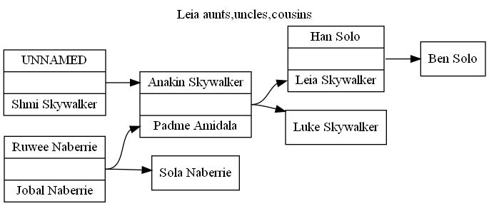

# draw-bowtie-plus
Genealogical bowtie chart with more options for descendents.

## Installation ##

- Requires python 3.6+
- Copy draw-bowtie-plus.py
- also requires gedcom library [readgedcom.py](https://github.com/johnandrea/readgedcom)
- Output makes use of Graphviz DOT format: [Graphviz](https://graphviz.org)

Or use the .exe file on MS-Windows which is a standalone program in that it doesn't need python or any other the other downloadables.

## Usage ##

Run the program with:
```
diff.py  family.ged  personxref >chart.dot 2>chart.err
```
where personxref is the gedcom id of the person in the middle of the bowtie.
Default options produce a bowtie chart.
Then convert the .dot file into a displayable file with one (or more) of:
```
graphviz -Tpng chart.dot -o chart.png
graphviz -Tsvg chart.dot -o chart.svg
graphviz -Tpdf chart.dot -o chart.pdf
```
See the Graphviz website for a complete list of [formats](https://graphviz.org/docs/outputs/)

## Options ##

--title="value"

Display a title on the output chart. Default is no title.

--iditem=value

Specify the item to identify the tester via each tester id. Default is "xref" which is the individual
XREF value in the GEDCOM file.
Other options might be "uuid", "refn", etc. If using a GEDCOM custom event specify it as "even dot" followed by
the event name, i.e. "even.extid", "even.myreference", etc.

--ancestors=n

Number of ancestor generations to produce. Default is 100

--descendents=n

Number of descendent generations to produce. Default is 100

--from=n

Number of generations back from the start person to start the descendants. Default is 0, i.e. the middle person, but that means only a plain bowtie chart. A "1" means parents of the middle person, "2" is grandparents, etc.

--down=n

Number of generations to display from the ancestors defined by "from". Default is 0, which also means output is a plain bowtie chart.

--dates

Include birth and death dates with names. Default is no dates.

--reverse-arrows

Reverse the order of the arrows between parents and children. Default is from parents to children.

--orientation=direction

Set the orientatation of the diagram in the DOT file output. Default is "TB" for top-to-bottom.
Other choices are "LR" for left-to-right plus "BT" (bottom-top) and "RL" (right-left).

--libpath=relative-path-to-library

The directory containing the readgedcom library, relative to the drawing program. Default is ".", the same location as this program file.


## Examples ##

For a standard bowtie chart (assuming 100 generations max in both directions)
```
draw-bowtie-plus.py family.ged  middlepersonxref >chart.dot 2>chart.err
```

For a list of only ancestors
```
draw-bowtie-plus.py --descendents=0  family.ged  middlepersonxref >chart.dot 2>chart.err
```

For a list of only descendents
```
draw-bowtie-plus.py --from=0 --ancestors=0  family.ged  middlepersonxref >chart.dot 2>chart.err
```

For all ancestors and cousins (including aunts and uncles)
```
draw-bowtie-plus.py --from=2 --down=2 --descendents=0  family.ged  middlepersonxref >chart.dot 2>chart.err
```

For middleperson's parents and siblings
```
draw-bowtie-plus.py --from=1 down=1 --ancestors=1 --descendents=1  family.ged  middlepersonxref >chart.dot 2>chart.err
```

To use the REFN tag to identify the middle person
```
draw-bowtie-plus.py --iditem=refn  family.ged  personrefn >chart.dot 2>chart.err
```

## Test Results ##

Look in the test-output directory for working examples with results.

For example, using the Skywalker family as input: display Leia's cousins with these options (test no.5)
```
--from=2 --down=2
```
Except that she has no cousins, but it does show her brother and aunt:


## Bugs ##

- families not attached to the middle person might appear if its a second marriage of an ancestor.
- second partnerships not handles very well
- cross family partners might not work well

## Bug reports ##

This code is provided with neither support nor warranty.

## Future Enhancements ##

- other output formats (gedcom, graphml )
- skip adoption relations
